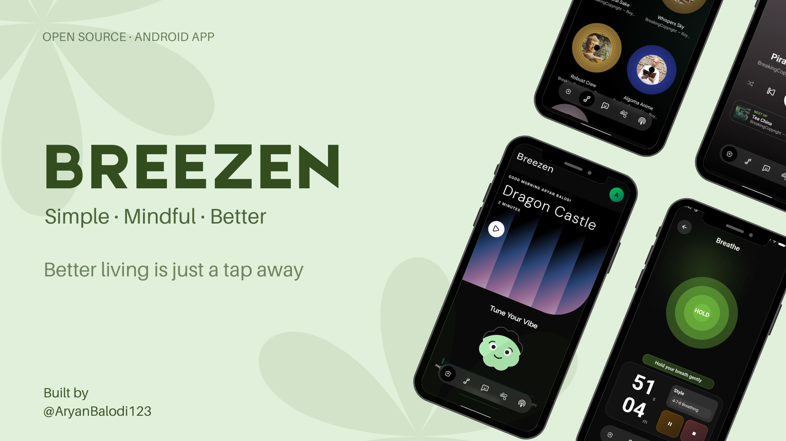
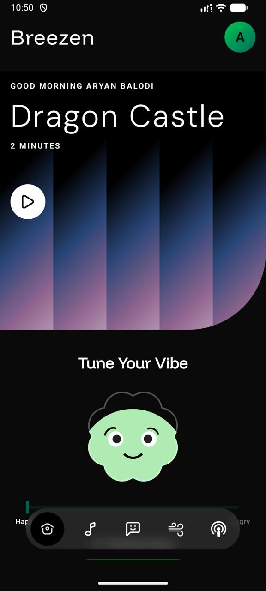
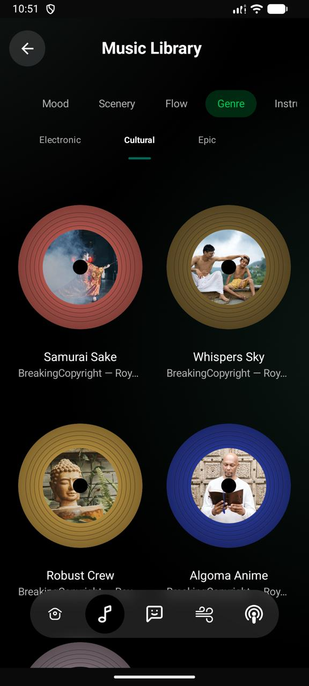
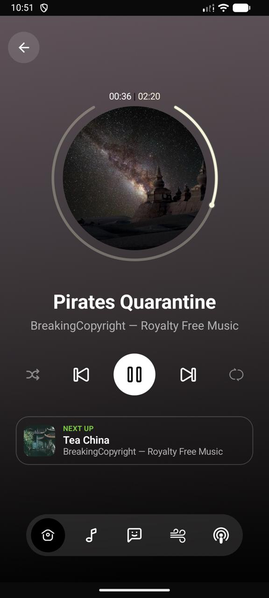
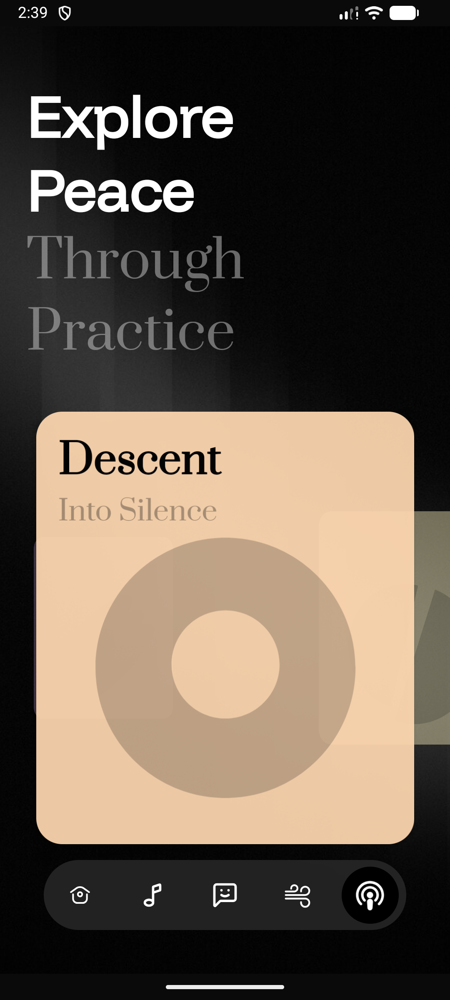
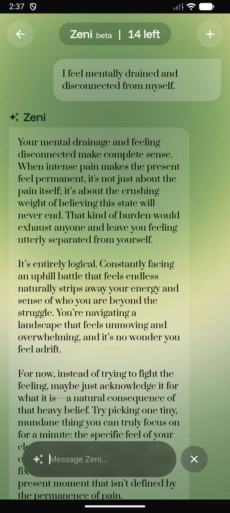
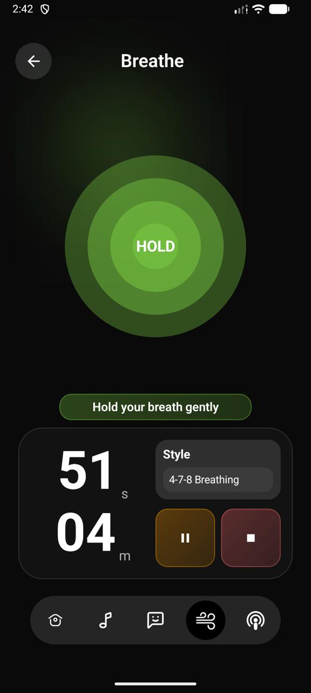

<div align="center">

# BREEZEN

**Simple · Mindful · Better**

A minimalist meditation and mindfulness app for Android

[](https://www.android.com)
[](https://kotlinlang.org)
[](https://developer.android.com/jetpack/compose)
[](./LICENSE)



</div>


## About

Breezen is a meditation and mindfulness application built with Jetpack Compose. The app provides guided meditations, breathing exercises, ambient soundscapes, and AI-powered mindfulness assistance to help users reduce stress and build daily mindfulness habits.

## Features

- **Guided Meditations** — Curated meditation sessions for different needs
- **Breathing Exercises** — Visual breathing guides with customizable patterns
- **Ambient Soundscapes** — Background audio for focus and relaxation
- **Daily Mood Tracking** — Track your emotional state over time
- **AI Chatbot** — Mindfulness companion powered by AI
- **Personalized Experience** — Daily affirmations and mood-based recommendations

## Screenshots

<div align="center">

| Home Screen | Music | Music Player |
|-------------|--------------|-------------------|
|  |  | |

| Meditation | ChatBot | Breathing Exercise |
|------------|---------|----------|
|  |  |

</div>

## Tech Stack

- **Language:** Kotlin
- **UI Framework:** Jetpack Compose (100% declarative UI)
- **Architecture:** MVVM with ViewModel state management
- **Navigation:** Jetpack Navigation Compose with custom transitions
- **Design System:** Material 3 with custom dark theme
- **Audio:** Media3 ExoPlayer
- **Backend:** Firebase & Supabase
- **Security:** Native C++ for sensitive operations

## Project Structure

```
breezen/
├── app/
│   ├── src/main/
│   │   ├── java/com/example/breezen/
│   │   │   ├── core/
│   │   │   │   ├── data/              # DataStoreManager, Preferences
│   │   │   │   ├── network/           # API clients (Gemini, Supabase)
│   │   │   │   └── ui/
│   │   │   │       ├── components/    # Reusable Compose components
│   │   │   │       ├── navigation/    # AppNavHost, Routes
│   │   │   │       ├── theme/         # Material 3 theme system
│   │   │   │       └── util/          # UI helpers, easing functions
│   │   │   └── feature/
│   │   │       ├── breathe/           # Breathing exercises
│   │   │       ├── chatbot/           # AI chat + ChatViewModel
│   │   │       ├── home/              # Dashboard + HomeViewModel
│   │   │       ├── meditation/        # Guided sessions + player
│   │   │       ├── music/             # Audio library + MusicViewModel
│   │   │       ├── onboarding/        # Sign in/up flows
│   │   │       ├── player/            # Audio player controls
│   │   │       └── settings/          # App settings, credits
│   │   ├── res/
│   │   │   ├── drawable/              # Icons and images
│   │   │   ├── font/                  # Custom fonts (DM Sans, Prata)
│   │   │   ├── raw/                   # Lottie animations, audio
│   │   │   └── values/                # Strings, colors, themes
│   │   └── cpp/                       # Native C++ for security
│   │       ├── CMakeLists.txt
│   │       └── keys.cpp               # Encrypted API keys
│   ├── build.gradle.kts
│   └── google-services.json
├── gradle/
├── build.gradle.kts
└── settings.gradle.kts
```

## Download

### For Users

Download the latest APK directly from the [Releases](https://github.com/yourusername/breezen/releases) tab.

[](https://github.com/yourusername/breezen/releases/latest)

### For Developers

#### Prerequisites

- Android Studio Hedgehog or later
- Minimum SDK: 24 (Android 7.0)
- Target SDK: 34 (Android 14)

#### Setup

1. Fork the repository
2. Clone your fork
```bash
git clone https://github.com/YOUR_USERNAME/breezen.git
cd breezen
```

3. Open the project in Android Studio

4. Sync Gradle and build the project

5. Run on an emulator or physical device

## Contributing

Contributions are welcome! Here's how you can help:

1. **Fork** the repository
2. **Create** a feature branch
   ```bash
   git checkout -b feature/amazing-feature
   ```
3. **Commit** your changes
   ```bash
   git commit -m 'Add some amazing feature'
   ```
4. **Push** to your fork
   ```bash
   git push origin feature/amazing-feature
   ```
5. **Open** a Pull Request

Please ensure your code follows the existing style and includes appropriate documentation.

## License

This project is licensed under the MIT License. See the [LICENSE](LICENSE) file for details.

## Contact

For questions or feedback, reach out via:
- Email: aryanb3244@gmail.com
- GitHub: [@Aryanbalodi123](https://github.com/yourusername)

---

<div align="center">

**Made with focus and intention**

If Breezen helps you find peace, consider ⭐ starring the repo

</div>
